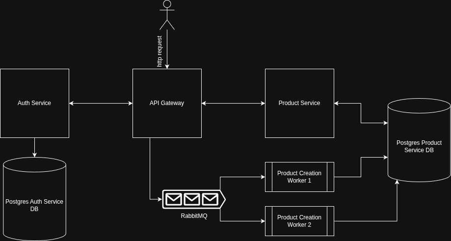

# Arquitectura de Mini Fudo

Mini Fudo está diseñado como un sistema de microservicios en Ruby con separación de responsabilidades, comunicación eficiente y un enfoque claro en escalabilidad, mantenibilidad y seguridad.



## Componentes principales

### 1. API Gateway

- Punto único de entrada para todas las peticiones externas.
- Valida tokens JWT en cada solicitud protegida.
- Publica mensajes en RabbitMQ para operaciones asincrónicas.
- Se comunica con los servicios internos mediante HTTP usando una clave API compartida.
- Expone un endpoint `/healthcheck` que responde 200 OK, útil para monitoreo y readiness checks.

### 2. Auth Service

- Permite registrar y autenticar usuarios.
- Hashea las contraseñas utilizando un algoritmo con salt para mayor seguridad.
- Genera tokens JWT válidos por 24 horas.
- Expone endpoints `/register`, `/login` y `/validate_token`.
- Expone un endpoint `/healthcheck` que responde 200 OK, útil para monitoreo y readiness checks.

### 3. Product Service

- Expone endpoints internos para la gestión de productos.
- No recibe peticiones externas directamente.
- Permite consultar productos por usuario.
- Expone un endpoint `/healthcheck` que responde 200 OK, útil para monitoreo y readiness checks.

### 4. Product Creation Workers

- Subscriptos a la cola de RabbitMQ.
- Cada worker procesa un mensaje, espera 5 segundos (para simular demora real), y persiste el producto en la base de datos del Product Service.
- Escalables horizontalmente (2 réplicas por defecto en docker-compose).

### 5. RabbitMQ

- Broker de mensajes responsable de desacoplar la creación de productos.
- Configurado con cola durables para garantizar la persistencia de mensajes.
- Configurado con Dead Letter Queue en caso de errores en el procesamiento.

### 6. PostgreSQL

- Base de datos separada por servicio (`auth` y `product`).
- Migraciones gestionadas con Sequel.
- Índices por `user_id` para búsquedas eficientes.

---

## Seguridad

- **Contraseñas**: Hasheadas con `salt` mediante algoritmos seguros.
- **JWT**: Tokens firmados con clave secreta. Incluyen `user_id` y expiran a las 24 horas.
- **API Keys internas**: Protegen las comunicaciones entre el API Gateway y los servicios internos.
- **RabbitMQ**: Protegido por usuario y contraseña definidos en `.env`.

---

## Flujo de creación de producto

```plaintext
[1] Cliente -> POST /products (con JWT)
[2] API Gateway valida el token llamando a Auth Service y publica un mensaje en RabbitMQ
[3] Uno de los Workers consume el mensaje
[4] El Worker crea el producto en la base de datos del Product Service
[5] Cliente puede luego consultar productos mediante GET /products (con su respectivo JWT)
```

---

## Escalabilidad y tolerancia a fallos

- Cada componente se ejecuta en un contenedor aislado (Docker), permitiendo escalar individualmente.
- RabbitMQ asegura que los mensajes no se pierdan ante fallos del worker.
- Workers múltiples permiten procesar cargas de forma concurrente.
- La arquitectura permite agregar nuevos servicios (por ejemplo, Orders) sin modificar los existentes.

---
